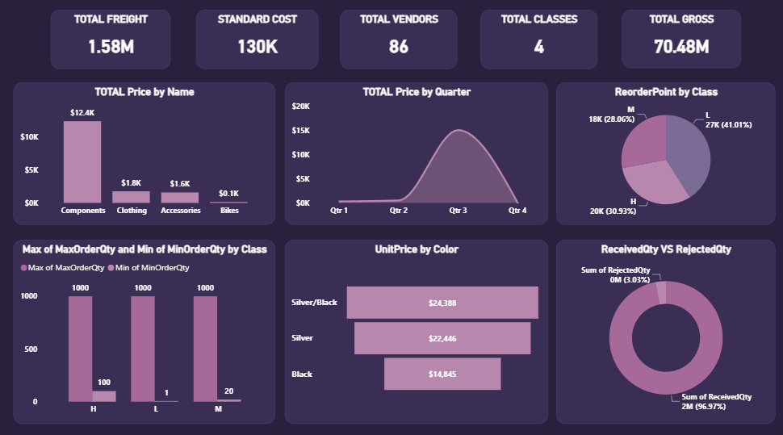

# 🚚 Inventory & Supply Chain Dashboard - Power BI

## 📌 Project Overview
This dashboard provides a comprehensive analysis of **inventory and supply chain performance**, tracking freight costs, vendor metrics, pricing trends, and order quantities. Built using **Power BI** with **Power Query** for data transformation and **Figma** for prototyping, the dashboard enables supply chain managers to monitor vendor performance, optimize reorder points, and make data-driven procurement decisions.

## 🖥️ Dashboard Preview

## 🎯 Objectives
- Monitor total freight, standard cost, vendor count, and gross revenue.
- Analyze pricing trends by product name and quarter.
- Track reorder points by product class (H, L, M).
- Identify order quantity patterns by class.
- Analyze unit pricing by color.
- Monitor received vs rejected quantities for quality control.

## 🛠️ Tools Used
- **Power BI** – Dashboard design and interactive visualizations
- **Power Query** – Data extraction, cleaning, and transformation
- **DAX** – Custom measures for KPIs and calculations
- **Figma** – Wireframing and dashboard prototype design

## 💡 Key Insights
- **Total Freight** costs amount to **$1.58M**, with a **Standard Cost** of **$130K**.
- There are **86 vendors** across **4 product classes** (H, L, M).
- **Total Gross** revenue reaches **$70.48M**.
- **Components** lead in total price, followed by **Clothing**, **Accessories**, and **Bikes**.
- Pricing shows a slight increase from **Q1** to **Q4**, indicating seasonal demand trends.
- **Class L** products have the highest reorder point (**41%**), followed by **Class H** (**31%**) and **Class M** (**28%**).
- **Silver/Black** products command the highest unit price ($24.39), while **Black** products are the lowest ($14.85).
- **Received Quantity** accounts for **97%** of total orders, with only **3%** rejected, indicating strong supplier quality.

## 📋 Dashboard Features

### Key Performance Indicators (KPIs)
- **Total Freight** – Overall shipping costs
- **Standard Cost** – Baseline cost of goods
- **Total Vendors** – Number of active suppliers
- **Total Classes** – Product classification count
- **Total Gross** – Gross revenue

### Filters & Interactivity
- **Product Name** – Components, Clothing, Accessories, Bikes
- **Class** – H, L, M
- **Quarter** – Q1, Q2, Q3, Q4

### Visualizations
- **Cards** – KPI summaries at the top
- **Bar charts** – Total price by product name
- **Line chart** – Price trends by quarter
- **Pie charts** – Reorder point distribution by class
- **Clustered bar chart** – Max and Min order quantities by class
- **Bar chart** – Unit price by color
- **Donut chart** – Received vs Rejected quantity breakdown

---
